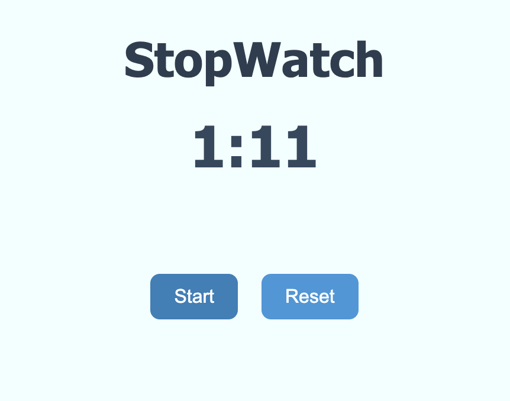

# ⏱️ React Stopwatch Component

A reusable and modular stopwatch built with **React**. It supports **start**, **stop**, and **reset** functionality with clean separation of logic and UI components.

## 🧩 Features

- Reusable Stopwatch component
- Start, Stop, and Reset controls
- Clean and formatted time display (MM:SS)
- Uses modern React Hooks: `useState`,`useEffect`, `useCallback`, `useMemo`
- Proper interval cleanup to avoid memory leaks
- Component-based structure for easy maintenance

---

## 🛠️ Technologies Used

- React (with Hooks)
- JavaScript (ES6+)
- CSS Modules / Basic styling

---

## 🚀 Getting Started

### 1. Clone the Repository

```bash
git clone https://github.com/shardareddy12/React-Stopwatch.git
cd React-Stopwatch

```
---

###  📸 Screenshot



---
